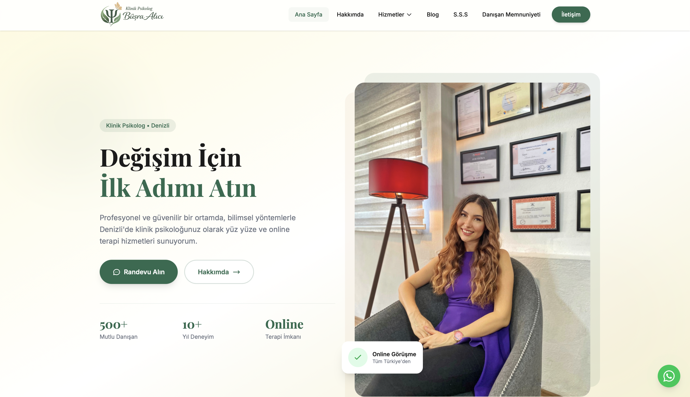
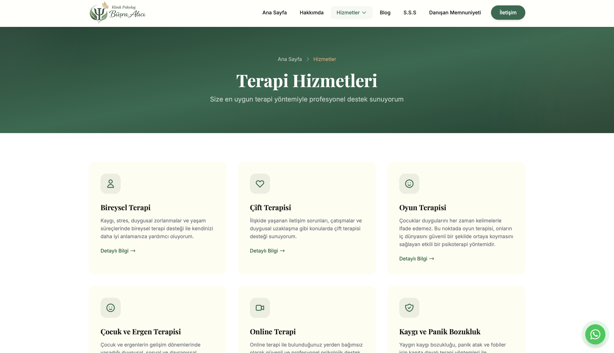
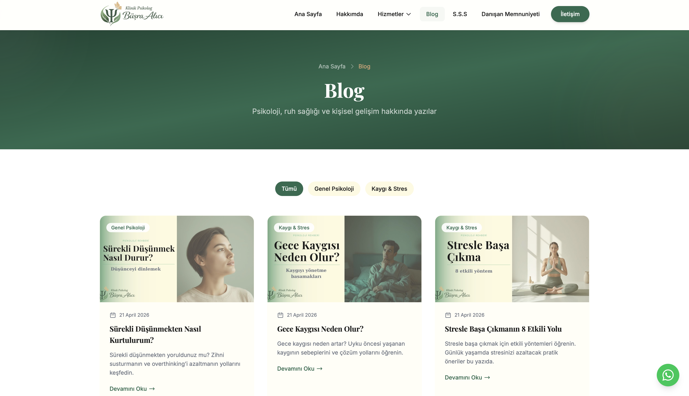
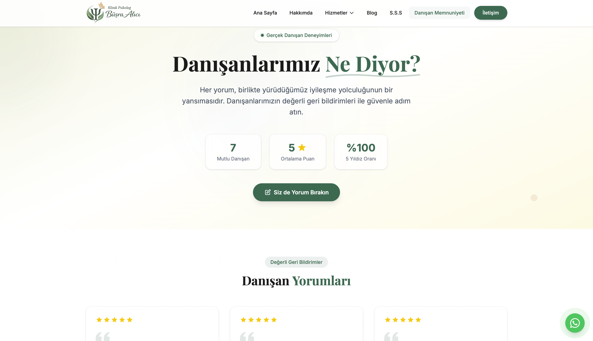
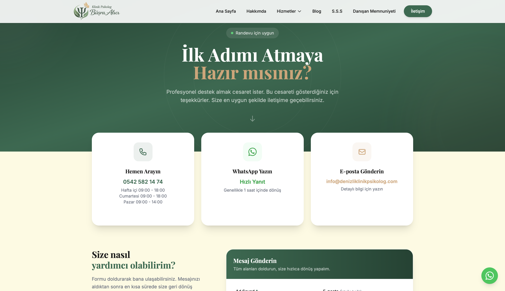
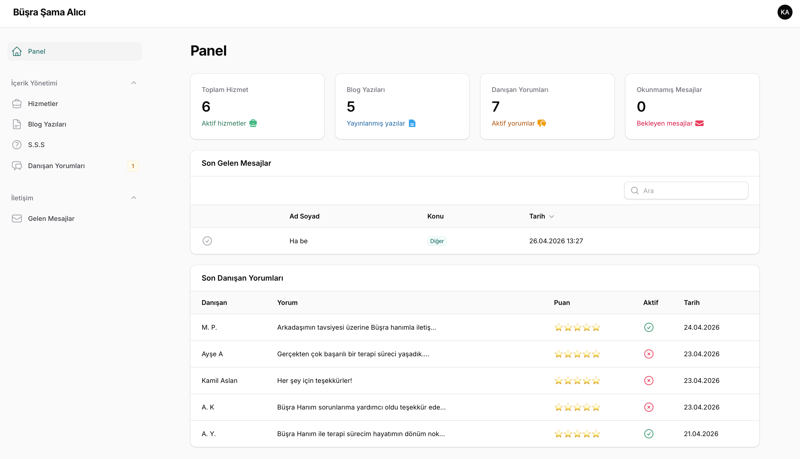
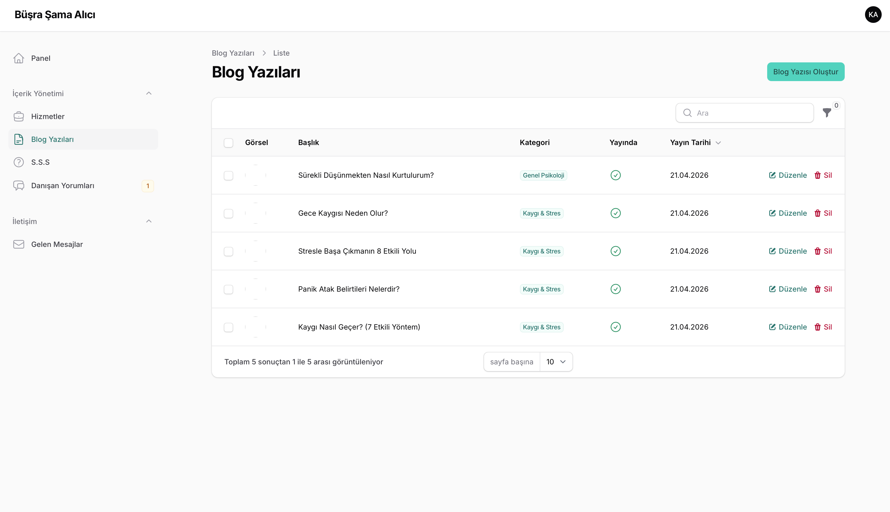
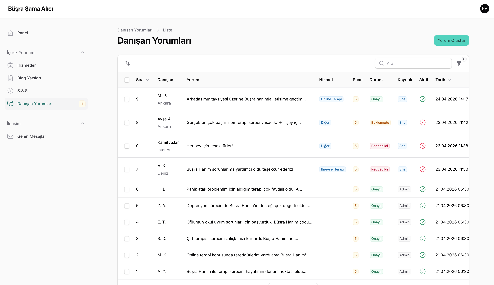

# 🧠 Klinik Psikolog Web Sitesi

Denizli'de hizmet veren bir klinik psikolog için sıfırdan tasarlayıp geliştirdiğim profesyonel web sitesi. Hazır tema veya sayfa oluşturucu kullanılmadan, modern web teknolojileri ile tamamen elle kodlanmıştır.

🌐 **Canlı Site:** [denizliklinikpsikolog.com](https://denizliklinikpsikolog.com)

> Bu repo, projenin kaynak kodunu değil, geliştirme sürecini ve özelliklerini sergileyen bir showcase (vitrin) reposudur.

---

## 🎯 Projenin Amacı

Bir klinik psikoloğun dijital dünyada profesyonel ve güvenilir bir şekilde var olabilmesini sağlamak. Site; danışanlara güven veren, bilgiye kolay ulaşılabilen ve yönetimi basit olan bir platform olarak tasarlandı.

Denizli'deki yüz yüze terapi hizmetlerinin yanı sıra, tüm Türkiye ve yurt dışına yönelik online terapi seçeneğini de ön plana çıkaracak biçimde kurgulandı.

---

## 📸 Ekran Görüntüleri

### Ana Sayfa


### Mobil Görünüm


### Hizmetler


### Blog


### Danışan Memnuniyeti


### İletişim


### Admin Panel




---

## ✨ Neler Yaptım?

### 🎨 Tasarım
Bir psikolog web sitesinin ilk anda huzur ve güven vermesi gerektiğine inandım. Renk paleti olarak doğadan ilham alan yumuşak yeşil tonları, krem arka planlar ve zarif tipografi tercih ettim. Her sayfa gereksiz karmaşadan uzak, temiz ve odaklanmış bir deneyim sunacak şekilde tasarlandı. Tüm sayfalar mobil, tablet ve masaüstü cihazlarda kusursuz şekilde çalışıyor.

### 🔧 Admin Paneli
Site sahibinin teknik bilgiye ihtiyaç duymadan içeriklerini yönetebilmesi en büyük önceliğimdi. Filament ile oluşturduğum admin paneli sayesinde blog yazıları, hizmet sayfaları, sıkça sorulan sorular ve danışan yorumları birkaç tıklamayla yönetilebiliyor.

### 💬 Danışan Yorum Sistemi
Projenin en özenli bölümlerinden biri oldu. Danışanlar siteyi ziyaret edip deneyimlerini paylaşabiliyor, yıldız puanı verebiliyor ve hangi hizmetten faydalandıklarını belirtebiliyor. Her yorum önce admin panelinde inceleniyor, uygun görülenler onaylanarak sitede gösteriliyor. Böylece hem gerçek geri bildirimler toplanıyor hem de içerik kalitesi kontrol altında tutuluyor.

### 📝 Blog Sistemi
SEO açısından kritik olan blog bölümü, uzmanlık alanındaki bilgilerin danışanlarla ve potansiyel ziyaretçilerle paylaşılmasına olanak tanıyor. Her blog yazısı için özel SEO meta etiketleri, Open Graph bilgileri ve otomatik sitemap entegrasyonu mevcut.

### 📞 İletişim Formu
AJAX tabanlı form sayesinde ziyaretçiler sayfayı terk etmeden mesaj gönderebiliyor. Telefon numarası otomatik formatlanıyor, tüm alanlar hem frontend hem backend tarafında doğrulanıyor. Gelen mesajlar admin paneline düşüyor.

### 🔍 SEO & Performans
Site baştan sona SEO odaklı geliştirildi. Her sayfada benzersiz meta açıklamalar, Schema.org yapılandırılmış verileri, canonical URL'ler ve Open Graph etiketleri bulunuyor. Otomatik sitemap.xml ve robots.txt ile arama motorları siteyi verimli şekilde tarayabiliyor. Google Search Console entegrasyonu tamamlandı.

Performans tarafında görseller WebP formatına dönüştürüldü, Gzip sıkıştırma ve tarayıcı önbellekleme aktif edildi, CSS/JS dosyaları Vite ile küçültülerek optimize edildi.

---

## 🛠️ Kullanılan Teknolojiler

| Alan | Teknoloji |
|------|-----------|
| Backend | Laravel 13, PHP 8.5 |
| Frontend | Tailwind CSS 4, Alpine.js 3 |
| Admin Panel | Filament 5.5 |
| Veritabanı | MySQL 8 |
| Build Tool | Vite 8 |
| Hosting | Hostinger |
| Versiyon Kontrolü | Git & GitHub |
| SSL | Let's Encrypt |

---

## 📋 Site Sayfaları

- **Ana Sayfa** — Hero section, hizmet tanıtımları, hakkında özet, danışan yorumları, blog önizleme, SSS
- **Hakkımda** — Psikolog hakkında detaylı bilgi ve kariyer geçmişi
- **Hizmetler** — 6 farklı terapi hizmeti (Bireysel, Çift, Oyun, Çocuk-Ergen, Online, Kaygı-Panik)
- **Blog** — SEO destekli blog yazıları
- **Danışan Memnuniyeti** — Onay mekanizmalı yorum sistemi + yorum formu
- **S.S.S** — Sıkça sorulan sorular (accordion yapısında)
- **İletişim** — AJAX form, Google Maps, çalışma saatleri, WhatsApp entegrasyonu
- **Gizlilik & KVKK** — Yasal uyumluluk sayfaları

---

## 🔐 Güvenlik Önlemleri

- HTTPS zorunluluğu ve otomatik yönlendirme
- Laravel CSRF koruması
- XSS koruması (Blade auto-escaping)
- SQL injection koruması (Eloquent ORM)
- Güvenlik header'ları (X-Frame-Options, X-XSS-Protection, X-Content-Type-Options)
- Admin panel erişim kontrolü
- KVKK uyumlu veri politikası

---

## 💻 Teknik Detaylar

### Yorum Onay Mekanizması

Siteden gelen yorumlar doğrudan yayınlanmaz. Her yorum "beklemede" statüsüyle veritabanına kaydedilir, admin panelinde incelendikten sonra onaylanır veya reddedilir.

```php
// Siteden gelen yorum — otomatik olarak beklemede
$validated['status'] = Testimonial::STATUS_PENDING;
$validated['source'] = Testimonial::SOURCE_WEBSITE;
$validated['is_active'] = false;
```

```php
// Admin panelde bekleyen yorum sayısı badge olarak gösteriliyor
public static function getNavigationBadge(): ?string
{
    $count = Testimonial::pending()->count();
    return $count > 0 ? (string) $count : null;
}
```

### SEO Dostu Türkçe Route Yapısı

```php
Route::get('/hizmetler/{slug}', [ServiceController::class, 'show']);
Route::get('/blog/{slug}', [BlogController::class, 'show']);
Route::get('/danisan-memnuniyeti', [TestimonialController::class, 'index']);
Route::post('/danisan-memnuniyeti', [TestimonialController::class, 'store']);
```

### Global Veri Yönetimi

Header ve footer'ın ihtiyaç duyduğu veriler merkezi bir View Composer ile tüm sayfalara otomatik aktarılıyor.

```php
View::composer(['partials.header', 'partials.footer'], function ($view) {
    $view->with('navServices', Service::where('is_active', true)
        ->orderBy('order')->get());
});
```

---

## 👨‍💻 Geliştirici

**Burak Berk Şama**
- GitHub: [@burakberksama](https://github.com/burakberksama)

---

## 📄 Lisans

Bu proje özel kullanım için geliştirilmiştir. Kaynak kodu bu repoda yer almamaktadır. Tüm hakları saklıdır.